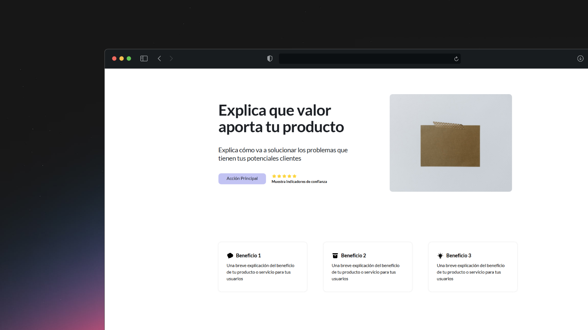

# Simple Landing Page Template

Este proyecto es una plantilla básica para una landing page, creada utilizando HTML, CSS y JavaScript. La plantilla está diseñada para ser fácilmente personalizable y adaptable a diferentes necesidades.

## Estructura del Proyecto

El proyecto está organizado en los siguientes archivos y carpetas:

- `index.html`: El archivo principal de la página web que contiene la estructura HTML.
- `styles.css`: El archivo de estilos CSS que define la apariencia de la página.
- `script.js`: El archivo de JavaScript que añade interactividad a la página.

## Descripción de Archivos

### index.html

Este archivo contiene la estructura básica de la landing page. Incluye elementos como el encabezado, el contenido principal y el pie de página. También se enlazan los archivos de estilos y scripts necesarios.

### styles.css

Este archivo define los estilos visuales de la página, incluyendo colores, fuentes, márgenes y otros aspectos de diseño. Utiliza selectores CSS para aplicar estilos a los diferentes elementos HTML.

### script.js

Este archivo contiene el código JavaScript que añade interactividad a la página. Puede incluir funciones para manejar eventos, validar formularios, o cualquier otra lógica que se necesite para mejorar la experiencia del usuario.

## Cómo Usar

1. **Clonar el repositorio**: Clona este repositorio en tu máquina local usando `git clone`.
2. **Abrir en un navegador**: Abre el archivo `index.html` en tu navegador web para ver la landing page.
3. **Personalizar**: Modifica los archivos `index.html`, `styles.css` y `script.js` según tus necesidades para personalizar la landing page.

## Personalización

- **HTML**: Edita el archivo `index.html` para cambiar el contenido de la página, como textos, imágenes y enlaces.
- **CSS**: Modifica el archivo `styles.css` para ajustar los estilos visuales, como colores, fuentes y disposición.
- **JavaScript**: Actualiza el archivo `script.js` para añadir o modificar la funcionalidad interactiva de la página.

## Requisitos

- Un navegador web moderno (Chrome, Firefox, Safari, Edge)
- Conocimientos básicos de HTML, CSS y JavaScript para personalizar la plantilla

## Contribuciones

Las contribuciones son bienvenidas. Si deseas mejorar esta plantilla, por favor, abre un issue o envía un pull request.

## Licencia

Este proyecto está licenciado bajo la Licencia MIT. Consulta el archivo `LICENSE` para más detalles.

---

¡Gracias por usar esta plantilla de landing page! Esperamos que te sea útil para tus proyectos.

## Copyright

© 2024 @DarielsMtz. Casi todos los derechos reservados.
